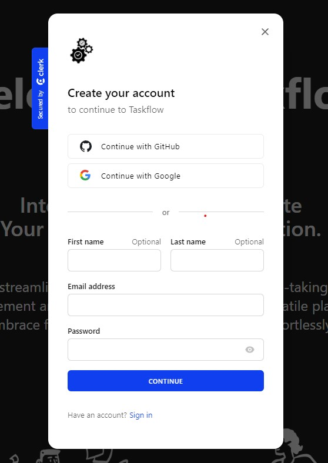
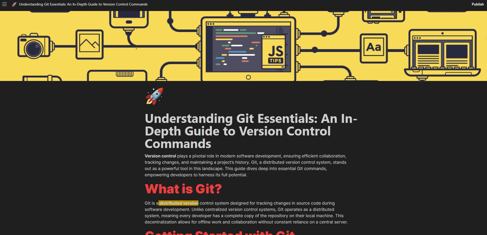

# Taskflow

Taskflow is a versatile productivity app that integrates various functionalities within a unified platform, catering to individual, team, and business workflows. With an array of features, it offers a seamless experience for creating documents, wikis, project boards, notes, and more.

## Key Features

1. Efficient Data Management
2. Easy Sharing and Customizable Interface
3. Organized Information Hierarchy
4. Security and Access Control
5. Versatile Accessibility
6. Recovery Capabilities

## Technologies Used

The technologies and tools used to develop this project are:

- TailwindCSS
- React
- Next.js
- Clerk
- Edge store
- Convex

## Getting Started

Follow these steps to get the project up and running on your local machine for development and testing:

### Prerequisites

Ensure the following requirements are met:

- Latest version of npm and Node.js installed.
- Windows/Linux/Mac machine.

### Installation

1. Clone the repository

   ```bash
   git clone https://github.com/username/projectname.git
   ```

2. Move into the project directory

   ```bash
   cd projectname
   ```

3. Install the dependencies

   ```bash
   npm install
   ```

4. Start the Convex server

   ```bash
   npm convex dev
   ```

5. Start the web server

   ```bash
   npm run dev
   ```

   Open the link displayed in the terminal with your browser to view the result.

### Usage Guide

To effectively utilize the platform, follow these steps:

1. **Sign Up and Profile Completion**
   - Access the portal and complete your profile after signing up.

2. **Workspace Creation and File Addition**
   - Create a workspace and add files relevant to your tasks.

3. **Note Making**
   - Initiate your note-making process within the workspace.

4. **Publish Your Work**
   - Finalize your content and publish it for intended use or sharing purposes.

## Screenshots






## Contributing

Contributions to Taskflow are welcome! To contribute, follow these steps:

1. Fork the repository.
2. Create a new branch for your feature or bug fix:

    ```bash
    git checkout -b feature/your-feature-name
    ```

3. Make changes and commit them:

    ```bash
    git commit -m "Add your commit message here"
    ```

4. Push your changes to your branch:

    ```bash
    git push origin feature/your-feature-name
    ```

5. Create a pull request on the main repository.

Please follow the project's coding guidelines and maintain a clean commit history.

## License

This website is licensed under the MIT License. See the [LICENSE](LICENSE) file for details.

## Contact

If you have any questions or feedback, feel free to reach out to us at <therahman14@gmail.com>. We're excited to hear from you and make this project even better!
